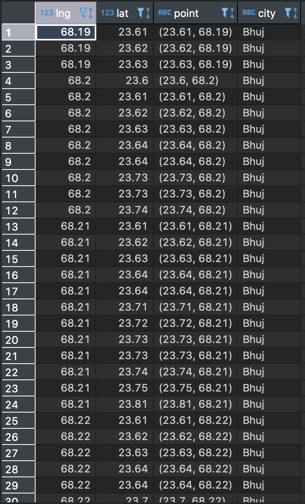

# Nearest city in India to every Grid Points v 1.1
---------------------
### Description 
---------------------
Nearest city distance in India for every Grid Points in 1000 step size (1km). Grid Points from map of India (District level) and find the nearest city from the worldcities table then calculate the distance (in Km) for each point in the grid.

The image below are the desired output : 

---------------------
Table of Contents
---------------------
1. Codes - A folder containing the codes and the step by step on how to find the nearest distance to every grid point 
2. Screenshots  - A folder containing the photos needed to find the nearest distance to every grid point

---------------------

