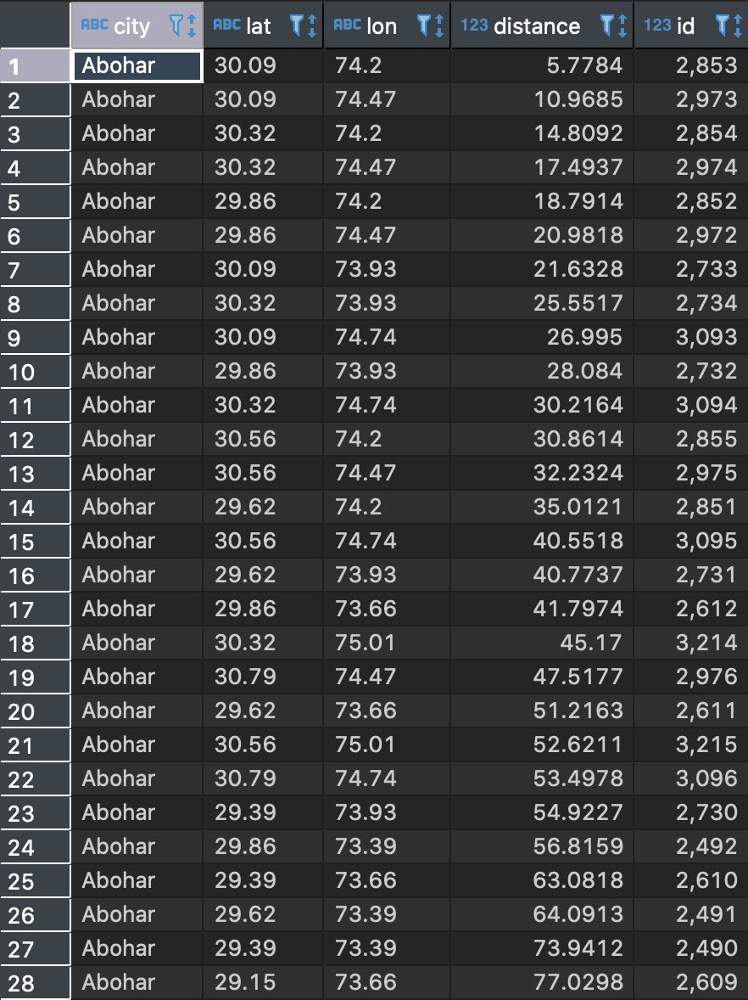

# Nearest city in India to every Grid Points v 1.0
---------------------
### Description 
---------------------
Nearest city distance in India for every Grid Points in 30 000 step size (30km). Grid Points from map of India (District level) and find the nearest city from the worldcities table then calculate the distance for each point in the grid.

The image below are the desired output : 

---------------------
Table of Contents
---------------------
1. Codes - A folder containing the codes on how to find the nearest distance to every grid point 
2. Sreenshots  - A folder containing the photos of the step by step needed to find the nearest distance to every grid point

---------------------

